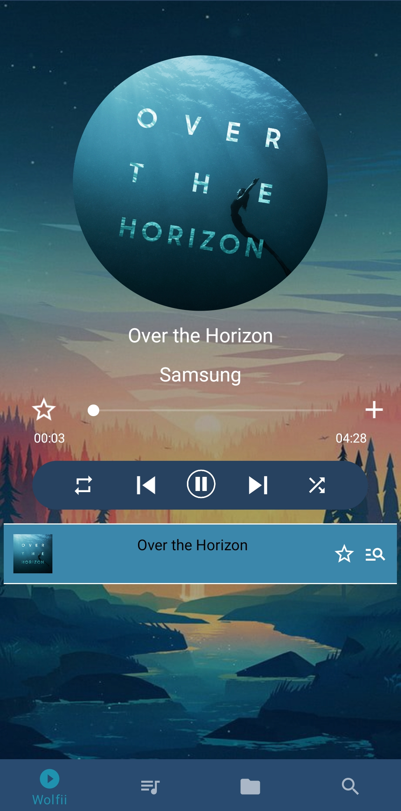
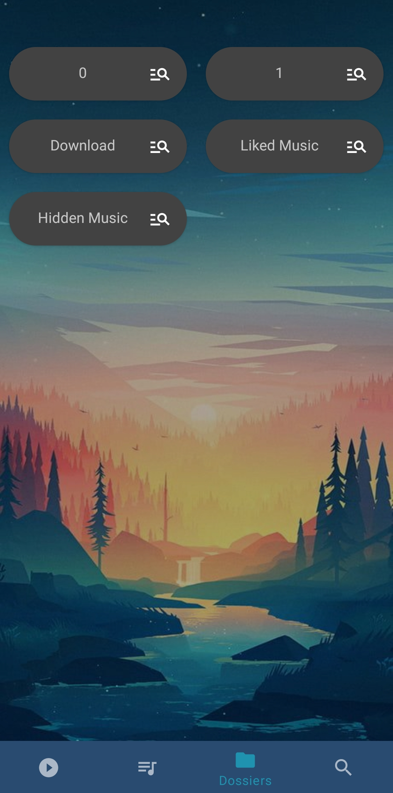

# Wolfii

## Description

Android music player made with Android Studio.  
Wolfii is music player for Android that alow you to:
- listen music
- create playlists
- search music by author/album/name in your files
- manage the application with the notification

## Images

<table>
  <tbody><tr>
    <td>Pulsar</td>
    <td>Penta-decathlon</td>
    <td>Kok's galaxy</td>
  </tr>
  <tr>
    <td></td>
    <td></td>    
    <td></td>
  </tr>
  
</tbody></table>

## Original link
https://github.com/clementreiffers/Wolfii-application-android-de-musique

## Contributors
@clementreiffers  
https://github.com/clementreiffers

@owen62  
https://github.com/owen62
